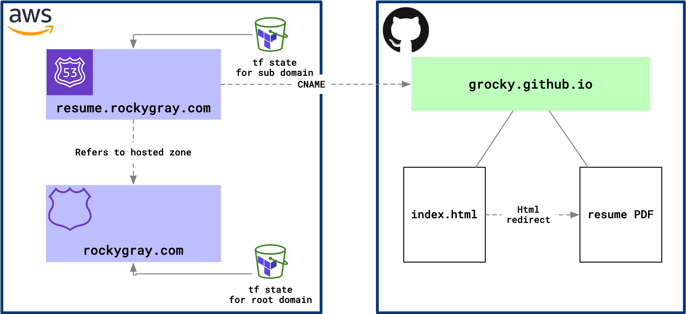

# Agent-Based Resume Framework

An intelligent resume generation system that automatically creates job-specific resumes by analyzing job descriptions and tailoring professional background data to highlight the most relevant experience and skills.

## ✨ Key Features

- **🤖 AI-Powered Content Optimization**: Analyzes job descriptions and rewrites achievements for maximum relevance
- **📊 Intelligent Job Analysis**: Extracts key requirements, skills, and role focus from job postings
- **🎯 Dynamic Content Selection**: Prioritizes experiences and achievements based on job requirements
- **⚡ Automated Workflow**: Single command generates tailored resume from job description to PDF
- **🛡️ Robust Fallbacks**: Works perfectly without AI APIs using rule-based content selection
- **🎨 Professional Styling**: Maintains beautiful AltaCV LaTeX formatting while enabling customization
- **🔧 Seamless Integration**: Extends existing build system with new intelligent capabilities

## 🚀 Quick Start

### PDF Workflow (Recommended)
```bash
# Download PDF job posting from company website/job board
# Then generate resume directly from PDF:
make resume-from-pdf PDF=path/to/job-posting.pdf

# Or two-step process for customization:
make job-from-pdf PDF=path/to/job-posting.pdf  # Extracts job info
make resume JOB=auto-generated-job-name         # Generates resume
```

### Manual Setup (Alternative)
```bash
# Initialize a new job application manually
make job-init JOB=2024-01-15_reddit_engineer

# Edit the job description
vim jobs/2024-01-15_reddit_engineer/job_description.md

# Generate tailored resume
make resume JOB=2024-01-15_reddit_engineer
```

### AI-Enhanced Setup (Optional)
For intelligent content optimization, add your API key:

```bash
# Copy the template
cp config/api_keys_example.yaml config/api_keys.yaml

# Add your API key
echo "openai:\n  api_key: your_key_here" > config/api_keys.yaml

# Or use environment variables
export OPENAI_API_KEY="your_key_here"
```

## 💼 How It Works

### 1. **PDF Intelligence**
- **Download job posting PDF** from company website or job board
- **Extract text content** using multiple PDF processing libraries
- **AI-powered parsing** identifies company, role, requirements, and culture
- **Auto-generates job folder** with structured information

### 2. **Job Analysis**
The system analyzes extracted content to identify:
- Required vs preferred skills
- Key responsibilities and expectations
- Company culture indicators
- Industry-specific keywords
- Role focus (technical, leadership, or hybrid)

### 3. **Content Optimization**
For each role in your background:
- **Prioritizes achievements** based on job relevance
- **Rewrites bullet points** to emphasize matching skills
- **Optimizes keywords** for ATS compatibility
- **Maintains authenticity** - never fabricates information

### 4. **Intelligent Selection**
- Selects most relevant experiences
- Adjusts achievement count based on role seniority
- Emphasizes quantified accomplishments
- Ensures single-page format compliance

## 📁 Project Structure

```
resume-agent/
├── data/                    # Structured professional data
│   ├── personal.yaml       # Contact info and branding
│   ├── background.yaml     # Role summaries by company
│   ├── achievements.yaml   # Detailed accomplishments
│   ├── skills.yaml        # Technical and soft skills
│   └── education_and_certs.yaml  # Degrees, certs, patents
├── jobs/                   # Job-specific configurations
│   └── YYYY-MM-DD_company_role/
│       ├── job_description.md
│       ├── prompt_vars.yaml
│       ├── analysis.yaml   # AI-generated job analysis
│       └── generated/      # Output files
├── templates/              # Modular LaTeX templates
│   ├── base_resume.tex    # Main document structure
│   └── sections/          # Header, experience, sidebar
├── tools/                 # Python generation engine
│   ├── generate.py        # Main generation script
│   ├── ai_client.py       # Multi-provider AI client
│   ├── job_analyzer.py    # Job description analysis
│   └── content_optimizer.py  # Content optimization
└── config/                # Configuration and API keys
    ├── settings.yaml      # Global preferences
    └── api_keys.yaml      # API credentials (gitignored)
```

## 🎯 Benefits

### For Job Applications
- **Zero Manual Entry**: PDF job postings automatically processed and analyzed
- **Higher Relevance**: Each resume is tailored to specific job requirements
- **ATS Optimization**: Keywords and formatting optimized for applicant tracking systems
- **Consistency**: Professional quality maintained across all applications
- **Speed**: Generate targeted resumes in seconds from job posting to PDF

### For Career Management
- **Structured Data**: Professional background stored in maintainable YAML format
- **Version Control**: Full history of applications and resume variations
- **Analytics Ready**: Track which achievements work best for different roles
- **Scalability**: Easy to update data and regenerate all resumes

### For Technical Workflow
- **Automation**: Integrates with existing LaTeX build pipeline
- **Flexibility**: Works with or without AI enhancement
- **Extensibility**: Modular architecture supports new features
- **Reliability**: Comprehensive error handling and fallbacks

## 🛠️ Advanced Usage

### PDF Workflow Commands
```bash
# Complete workflow: PDF to tailored resume
make resume-from-pdf PDF=path/to/job-posting.pdf

# Extract job info only (for review before generating)
make job-from-pdf PDF=path/to/job-posting.pdf

# Use custom job name instead of auto-generated
make resume-from-pdf PDF=job.pdf JOB=2024-01-15_my_dream_job
```

### Advanced Options
```bash
# Disable AI features (use rule-based processing)
make resume JOB=job-name NO_AI=1

# Force re-analysis of job description
python tools/generate.py --job=job-name --force-reanalysis

# Verbose logging for debugging
python tools/generate.py --job=job-name --verbose
```

### Customization
- **Content Preferences**: Adjust max achievements per role in `jobs/*/prompt_vars.yaml`
- **AI Settings**: Configure providers and models in `config/settings.yaml`
- **Template Modifications**: Customize LaTeX templates in `templates/` directory

## Architecture



This resume framework combines structured data management with intelligent content generation. The base resume is hosted on GitHub Pages with a custom domain, featuring a branding animation at [resume.rockygray.com](https://resume.rockygray.com).


The AI-enhanced system builds upon this foundation to provide dynamic, job-specific resume generation while maintaining the same professional presentation.

## Links

|                              |                |
| ---------------------------- | -------------- |
| Direct Download              | [Download]     |
| View with branding animation | [ViewBranding] |
| Direct View                  | [View]         |

[Download]: https://github.com/grocky/resume/raw/main/Rocky_Gray_Resume.pdf
[View]: ./Rocky_Gray_Resume.pdf
[ViewBranding]: https://resume.rockygray.com
